# 🩸 Batak Mythology: Tales of Terror

<!-- Centered logo -->
<p align="center">
  
</p>

<!-- Centered badges -->
<p align="center">
  
  
  
  
  
</p>

> _"Dulu, di sudut paling kelam desa terpencil di tanah Batak, seorang dukun serakah menantang batas alam..."_

---

## 📚 Table of Contents

- [👤 Author](#-author)
- [📜 Overview](#-overview)
- [🔮 Features](#-features)
- [🎮 Game Content](#-game-content)
- [📂 Project Structure](#-project-structure)
- [📊 Repository Visualization](#-repository-visualization)
- [🔄 Sequence Diagram: Horror Animation Flow](#-sequence-diagram-horror-animation-flow)
- [💻 Technical Requirements](#-technical-requirements)
- [⚙️ Installation](#️-installation)
- [🎮 Controls](#-controls)
- [📅 Development Timeline](#-development-timeline)
- [👥 Credits](#-credits)
- [⚠️ Warning](#️-warning)
- [📞 Contact](#-contact)

---

## 👤 Author

- **Nama**: Yahya Alfon Sinaga
- **NIM**: 231524064
- **Kelas**: 2B D4 TI

---

## 📜 Overview

**Batak Mythology: Tales of Terror** is a horror-themed interactive application exploring the dark folklore and mythology of the Batak people. Encounter terrifying mythological entities like the dreaded Begu Ganjang, all while experiencing a haunting combination of traditional Batak architecture and immersive horror design.

---

## 🔮 Features

### 💀 Immersive Horror

- Atmospheric sound effects & eerie music
- Distortion visuals, flickering lights, and shadows
- Creepy UI design with horror fonts and animations

### 🏚️ Cultural Integration

- Interactive 2D sketches of traditional Batak Bolon houses
- Customizable house configurations with animated parts

### 👻 Mythical Beings

- Interactive storytelling of Begu Ganjang
- Explore Batak folklore in a horror format

### 🎮 Real-Time Interaction

- Adjust animations & horror effect intensity
- Customize scenes and visuals

---

## 🩸 Game Content

| Scene         | Description                                                                  |
| ------------- | ---------------------------------------------------------------------------- |
| **Welcome**   | Horror-themed menu with responsive sounds                                    |
| **About**     | Learn about the creator (if you dare)                                        |
| **Guide**     | Instructions to navigate the horrors                                         |
| **Karya 1–4** | Progressive exploration from traditional sketches to supernatural encounters |
| **Intro**     | Narrative intro to the myth of Begu Ganjang                                  |

---

## 📂 Project Structure

```bash
[Project Root]/
├── Assets/
│   ├── Fonts/              # Horror-style fonts
│   ├── Images/
│   │   └── Sprites/        # Characters and objects
│   └── Sounds/
│       ├── Horror/         # Horror ambiance
│       └── Karya/          # Scene-specific audio
├── Scenes/
│   ├── Shaders/            # GLSL visual effects
│   └── UI/                 # UI scenes
└── Scripts/
    ├── Core/               # Core systems
    ├── Drawing/            # Batak house rendering
    │   ├── Components/
    │   ├── Configuration/
    │   └── Renderers/
    └── UI/                 # UI logic
```

## 📊 Repository Visualization

To better understand the structure and flow of the Batak Mythology: Tales of Terror project, here is a visual representation of the repository:


This visualization provides a high-level overview of the project's organization, making it easier to navigate and contribute.

## 🔄 Sequence Diagram: Horror Animation Flow

The following sequence diagram illustrates the interaction flow in the Karya4Scene, which features the haunted Batak house with animated horror elements:

```mermaid
---
config:
  theme: forest
---
sequenceDiagram
    participant User
    participant Karya4Scene
    participant IntroScene
    participant BuildingRenderer
    participant AudioSystem
    participant HorrorEffects
    participant PersonComponent
    User->>Karya4Scene: Load Scene
    activate Karya4Scene
    Karya4Scene->>Karya4Scene: _Ready()
    Karya4Scene->>IntroScene: Create and Show
    activate IntroScene
    Karya4Scene->>Karya4Scene: SetProcessInput(true)
    IntroScene-->>Karya4Scene: TreeExiting (Intro Completed)
    deactivate IntroScene
    Karya4Scene->>Karya4Scene: OnIntroCompleted()
    Karya4Scene->>Karya4Scene: InitializeMainGame()
    Karya4Scene->>BuildingRenderer: Create(this, _config)
    activate BuildingRenderer
    BuildingRenderer->>BuildingRenderer: InitializeSoundPlayers()
    BuildingRenderer->>BuildingRenderer: LoadSoundFiles()
    BuildingRenderer->>BuildingRenderer: InitializeDrawingParameters()
    Karya4Scene->>Karya4Scene: CreateControls()
    Karya4Scene->>Karya4Scene: CreateHorrorEffects()
    Karya4Scene->>HorrorEffects: Create _darkOverlay
    activate HorrorEffects
    Karya4Scene->>HorrorEffects: Create _flickerTimer
    Karya4Scene->>Karya4Scene: EnsureBackButtonAccessibility()
    loop Every Frame
        Karya4Scene->>Karya4Scene: _Process(delta)
        Karya4Scene->>BuildingRenderer: UpdateAnimation(delta)
        BuildingRenderer->>BuildingRenderer: Update Animation Time
        BuildingRenderer->>BuildingRenderer: Update Animation Stages
        BuildingRenderer->>BuildingRenderer: Update Sound Effects
        Karya4Scene->>Karya4Scene: ApplyAnimationSettings()
        Karya4Scene->>BuildingRenderer: SetAnimationSpeed()
        Karya4Scene->>BuildingRenderer: SetGhostScale()
        Karya4Scene->>BuildingRenderer: SetHorrorIntensity()
        Karya4Scene->>Karya4Scene: QueueRedraw()
        alt Flicker Timer Active
            HorrorEffects->>HorrorEffects: Update Flicker Effect
        end
    end
    User->>Karya4Scene: Input Event
    Karya4Scene->>Karya4Scene: _Input(event)
    alt Mouse Click on Back Button
        Karya4Scene->>Karya4Scene: NavigateToWelcomeScene()
    else Key Press
        alt Space Key
            Karya4Scene->>BuildingRenderer: StartAnimation()
            Karya4Scene->>HorrorEffects: Start Flicker Timer
        else Q/W Keys
            Karya4Scene->>BuildingRenderer: SetAnimationSpeed(±0.1)
            Karya4Scene->>Karya4Scene: Update Speed Label
        else Z/X Keys
            Karya4Scene->>Karya4Scene: Update Horror Effect Intensity(±0.1)
            Karya4Scene->>Karya4Scene: UpdateHorrorEffects()
            Karya4Scene->>BuildingRenderer: SetHorrorIntensity()
        else D/F Keys
            Karya4Scene->>Karya4Scene: Update Ghost Scale(±0.1)
            Karya4Scene->>BuildingRenderer: SetGhostScale()
        end
    end
    Karya4Scene->>Karya4Scene: _Draw()
    Karya4Scene->>BuildingRenderer: Draw()
    BuildingRenderer->>BuildingRenderer: DrawBuilding()
    BuildingRenderer->>BuildingRenderer: DrawHorrorEffects()
    alt Animation Stage 0
        BuildingRenderer->>BuildingRenderer: Show Building
    else Animation Stage 1
        BuildingRenderer->>BuildingRenderer: Show Ladder Animation
        BuildingRenderer->>AudioSystem: Play Ladder Sound
    else Animation Stage 2
        BuildingRenderer->>BuildingRenderer: Show Rolling Head
        BuildingRenderer->>AudioSystem: Play Rolling Head Sound
    else Animation Stage 3
        BuildingRenderer->>PersonComponent: Create Ghost Characters
        BuildingRenderer->>AudioSystem: Play Ghost Sounds
    else Animation Stage 4
        BuildingRenderer->>BuildingRenderer: Trigger Jumpscare
        BuildingRenderer->>AudioSystem: Play Jumpscare Sound
    end
    User->>Karya4Scene: Resize Window
    Karya4Scene->>Karya4Scene: _Notification(NotificationWMSizeChanged)
    Karya4Scene->>BuildingRenderer: InitializeDrawingParameters(new size)
    User->>Karya4Scene: Press Escape/Back Button
    Karya4Scene->>Karya4Scene: NavigateToWelcomeScene()
    deactivate BuildingRenderer
    deactivate HorrorEffects
    deactivate Karya4Scene
```



### 📝 Sequence Diagram Explanation

#### Initialization Phase

1. **Scene Loading**: When the user loads Karya4Scene, it initializes and shows an intro narrative about Begu Ganjang
2. **Intro Completion**: After the intro finishes, the main game initializes with the BuildingRenderer
3. **Setup**: The system creates horror effects, sound players, and UI controls

#### Runtime Loop

1. **Animation Updates**: Every frame, the animation time advances, potentially triggering new animation stages
2. **Horror Effects**: Flickering lights and other horror effects update based on intensity settings
3. **User Controls**: Players can adjust animation speed, ghost scale, and horror intensity

#### Animation Stages

1. **Stage 0**: Initial display of the Batak house
2. **Stage 1**: Ladder animation with creaking sounds
3. **Stage 2**: Rolling head animation with eerie sound effects
4. **Stage 3**: Ghost characters appear with haunting sounds
5. **Stage 4**: Final jumpscare with intense audio

#### User Interaction

- **Space Key**: Starts the horror animation sequence
- **Q/W Keys**: Adjusts animation speed
- **Z/X Keys**: Controls horror effect intensity
- **D/F Keys**: Changes ghost scale
- **Back Button/Escape**: Returns to the welcome screen

This diagram illustrates how the horror elements are orchestrated to create a progressively terrifying experience while maintaining user control over the intensity.

---

## 💻 Technical Requirements

- Godot Engine 4.4+
- GPU with shader support
- Headphones for immersive audio
- Keyboard & mouse

---

## ⚙️ Installation

1. **Clone the repository**

   ```bash
   git clone https://github.com/codeyzx/ets-komgraf.git
   ```

2. **Open in Godot**

   - Launch Godot Engine
   - Click **Import**
   - Select `project.godot` in the project folder

3. **Run the Project**
   - Press **F5** or click the **Play** button

---

## 🎮 Controls

| Input        | Action                         |
| ------------ | ------------------------------ |
| Mouse        | Navigate menus, interact       |
| Enter        | Advance Intro Scene text       |
| Sliders      | Adjust horror effect intensity |
| Back Buttons | Return to previous screen      |

---

## 📅 Development Timeline

Untuk melihat development timeline, silakan cek di file [CHANGELOG.md](./CHANGELOG.md).

---

## 👥 Credits

> Terima kasih kepada sumber-sumber berikut yang telah berkontribusi dalam membangun suasana horor proyek ini:

| 🔖 Kategori          | 🎨 Deskripsi                                        | 🔗 Sumber                                         |
| -------------------- | --------------------------------------------------- | ------------------------------------------------- |
| 🅰️ **Fonts**         | Custom horror fonts untuk antarmuka                 | [dafont.com](https://www.dafont.com/)             |
| 🔊 **Sounds**        | Efek suara ambience, detak jantung, dan suara hantu | [pixabay.com](https://pixabay.com/)               |
| 🌫️ **Shaders & FX**  | Efek kabut, bayangan, distorsi, tetesan darah       | _Dibuat secara manual + referensi ShaderToy_      |
| 🖼️ **Images**        | Elemen visual seperti objek dan tekstur             | [pngwing.com](https://www.pngwing.com/)           |
| 🎨 **Illustrations** | Ilustrasi pendukung untuk adegan                    | [shutterstock.com](https://www.shutterstock.com/) |

---

## ⚠️ Warning

> _"Sekarang, kau sudah melihatnya... dan ia pun telah melihatmu..."_

Contains horror themes, disturbing imagery, sudden noises, and mythological content. Viewer discretion is advised, especially for those sensitive to flashing images or intense horror.

---

## 📞 Contact

Feel brave enough to reach out?

- 💬 Instagram: [@yahyaalfon](https://www.instagram.com/yahyaalfon/)
- 💻 GitHub: [@codeyzx](https://github.com/codeyzx)

---

> _"Semakin lama kau memandang, tubuhnya menjulang makin tinggi... hingga langit pun terasa dekat."_
