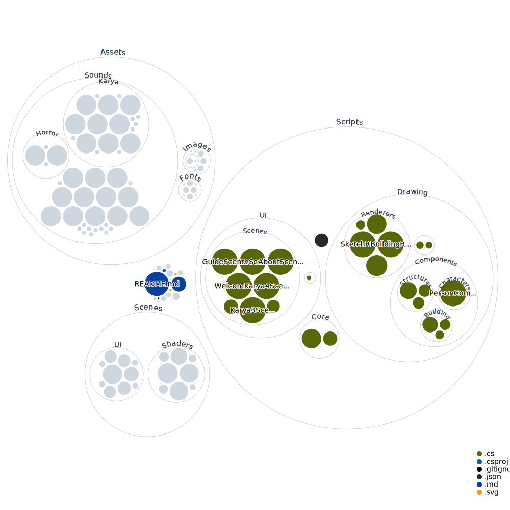

# 🩸 Batak Mythology: Tales of Terror

<!-- Centered logo -->
<p align="center">
  
</p>

<!-- Centered badges -->
<p align="center">
  
  
  
  
  
</p>

> _"Dulu, di sudut paling kelam desa terpencil di tanah Batak, seorang dukun serakah menantang batas alam..."_

---

## 📚 Table of Contents

- [👤 Author](#-author)
- [📜 Overview](#-overview)
- [🔮 Features](#-features)
- [🎮 Game Content](#-game-content)
- [📂 Project Structure](#-project-structure)
- [📊 Repository Visualization](#-repository-visualization)
- [💻 Technical Requirements](#-technical-requirements)
- [⚙️ Installation](#️-installation)
- [🎮 Controls](#-controls)
- [📅 Development Timeline](#-development-timeline)
- [👥 Credits](#-credits)
- [⚠️ Warning](#️-warning)
- [📞 Contact](#-contact)

---

## 👤 Author

- **Nama**: Yahya Alfon Sinaga
- **NIM**: 231524064
- **Kelas**: 2B D4 TI

---

## 📜 Overview

**Batak Mythology: Tales of Terror** is a horror-themed interactive application exploring the dark folklore and mythology of the Batak people. Encounter terrifying mythological entities like the dreaded Begu Ganjang, all while experiencing a haunting combination of traditional Batak architecture and immersive horror design.

---

## 🔮 Features

### 💀 Immersive Horror

- Atmospheric sound effects & eerie music
- Distortion visuals, flickering lights, and shadows
- Creepy UI design with horror fonts and animations

### 🏚️ Cultural Integration

- Interactive 2D sketches of traditional Batak Bolon houses
- Customizable house configurations with animated parts

### 👻 Mythical Beings

- Interactive storytelling of Begu Ganjang
- Explore Batak folklore in a horror format

### 🎮 Real-Time Interaction

- Adjust animations & horror effect intensity
- Customize scenes and visuals

---

## 🩸 Game Content

| Scene         | Description                                                                  |
| ------------- | ---------------------------------------------------------------------------- |
| **Welcome**   | Horror-themed menu with responsive sounds                                    |
| **About**     | Learn about the creator (if you dare)                                        |
| **Guide**     | Instructions to navigate the horrors                                         |
| **Karya 1–4** | Progressive exploration from traditional sketches to supernatural encounters |
| **Intro**     | Narrative intro to the myth of Begu Ganjang                                  |

---

## 📂 Project Structure

```bash
[Project Root]/
├── Assets/
│   ├── Fonts/              # Horror-style fonts
│   ├── Images/
│   │   └── Sprites/        # Characters and objects
│   └── Sounds/
│       ├── Horror/         # Horror ambiance
│       └── Karya/          # Scene-specific audio
├── Scenes/
│   ├── Shaders/            # GLSL visual effects
│   └── UI/                 # UI scenes
└── Scripts/
    ├── Core/               # Core systems
    ├── Drawing/            # Batak house rendering
    │   ├── Components/
    │   ├── Configuration/
    │   └── Renderers/
    └── UI/                 # UI logic
```

## 📊 Repository Visualization

To better understand the structure and flow of the Batak Mythology: Tales of Terror project, here is a visual representation of the repository:



This visualization provides a high-level overview of the project's organization, making it easier to navigate and contribute.

---

## 💻 Technical Requirements

- Godot Engine 4.4+
- GPU with shader support
- Headphones for immersive audio
- Keyboard & mouse

---

## ⚙️ Installation

1. **Clone the repository**

   ```bash
   git clone https://github.com/codeyzx/ets-komgraf.git
   ```

2. **Open in Godot**

   - Launch Godot Engine
   - Click **Import**
   - Select `project.godot` in the project folder

3. **Run the Project**
   - Press **F5** or click the **Play** button

---

## 🎮 Controls

| Input        | Action                         |
| ------------ | ------------------------------ |
| Mouse        | Navigate menus, interact       |
| Enter        | Advance Intro Scene text       |
| Sliders      | Adjust horror effect intensity |
| Back Buttons | Return to previous screen      |

---

## 📅 Development Timeline

Untuk melihat development timeline, silakan cek di file [CHANGELOG.md](./CHANGELOG.md).

---

## 👥 Credits

> Terima kasih kepada sumber-sumber berikut yang telah berkontribusi dalam membangun suasana horor proyek ini:

| 🔖 Kategori          | 🎨 Deskripsi                                        | 🔗 Sumber                                         |
| -------------------- | --------------------------------------------------- | ------------------------------------------------- |
| 🅰️ **Fonts**         | Custom horror fonts untuk antarmuka                 | [dafont.com](https://www.dafont.com/)             |
| 🔊 **Sounds**        | Efek suara ambience, detak jantung, dan suara hantu | [pixabay.com](https://pixabay.com/)               |
| 🌫️ **Shaders & FX**  | Efek kabut, bayangan, distorsi, tetesan darah       | _Dibuat secara manual + referensi ShaderToy_      |
| 🖼️ **Images**        | Elemen visual seperti objek dan tekstur             | [pngwing.com](https://www.pngwing.com/)           |
| 🎨 **Illustrations** | Ilustrasi pendukung untuk adegan                    | [shutterstock.com](https://www.shutterstock.com/) |

---

## ⚠️ Warning

> _"Sekarang, kau sudah melihatnya... dan ia pun telah melihatmu..."_

Contains horror themes, disturbing imagery, sudden noises, and mythological content. Viewer discretion is advised, especially for those sensitive to flashing images or intense horror.

---

## 📞 Contact

Feel brave enough to reach out?

- 💬 Instagram: [@yahyaalfon](https://www.instagram.com/yahyaalfon/)
- 💻 GitHub: [@codeyzx](https://github.com/codeyzx)

---

> _"Semakin lama kau memandang, tubuhnya menjulang makin tinggi... hingga langit pun terasa dekat."_
